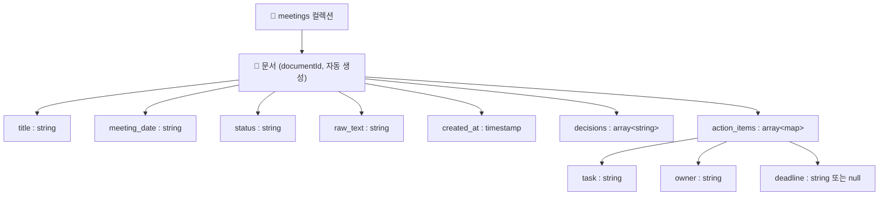
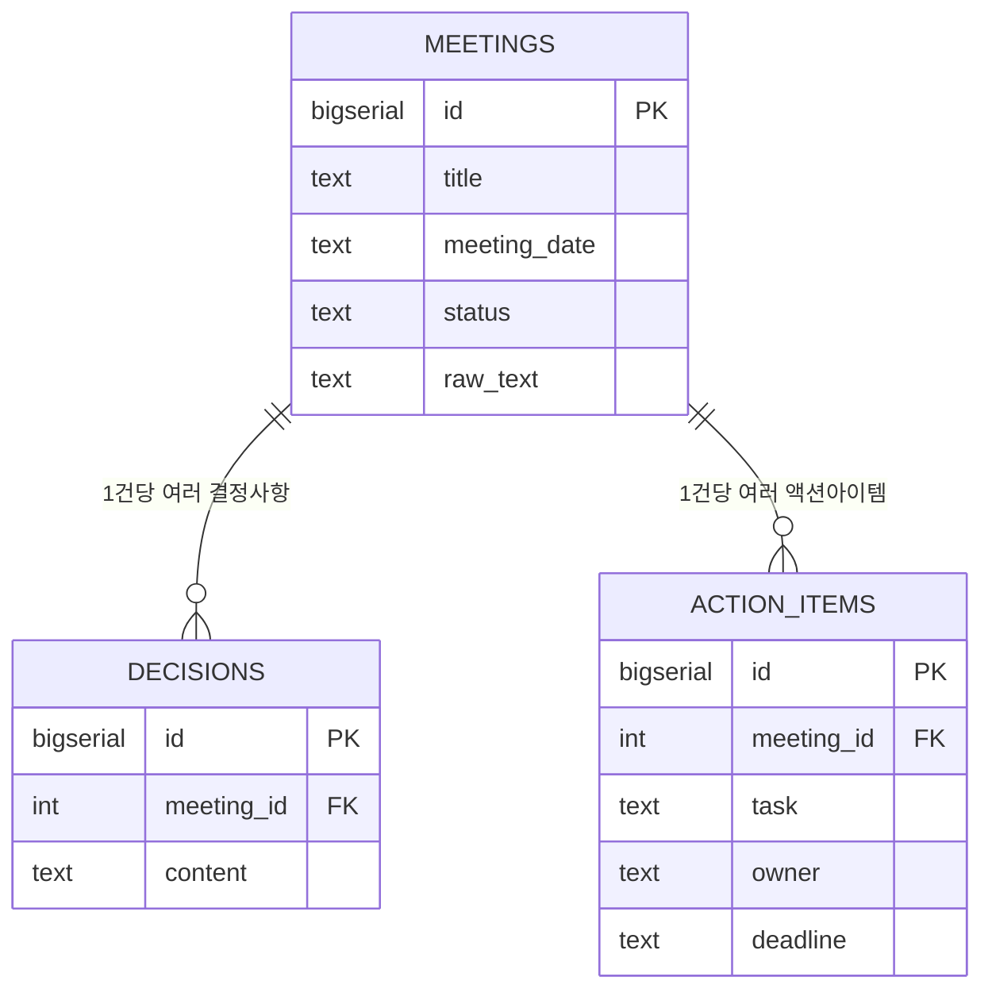
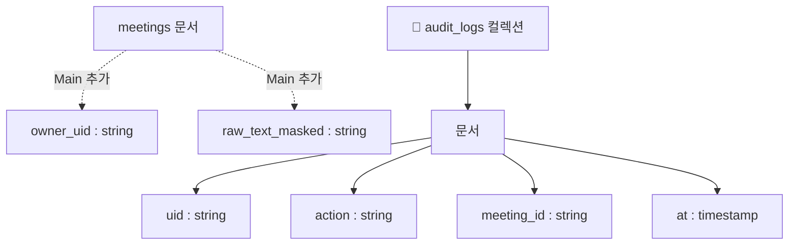

# ERD — 회의록 STT 요약 서비스 (Firestore 데이터 모델)

> 상태: ✅ 채택됨(2026-08-24). PRD는 [PRD-MVP.md](PRD-MVP.md) / [PRD-MAIN.md](PRD-MAIN.md)로 분리됨 — 아래 1~3절은 MVP·Main 공통 기본 스키마, 4절이 Main에서 추가되는 확장 스키마.
>
> Firestore는 NoSQL 문서형이라 전통적 관계형 ERD(FK·JOIN)가 아니라 **컬렉션-문서-필드 구조**로 표현. RDBMS로 설계했다면 어떻게 달라졌을지 비교도 함께 남김(발표용 근거 자료). 데이터 모델(이 문서) 자체는 웹/앱 여부와 무관하게 유효함(앱은 항상 백엔드를 거쳐 Firestore에 접근 — [PRD-MVP.md](PRD-MVP.md) 4절 참고).

## 1. 컬렉션 구조

```
meetings (컬렉션)
└── {documentId} (문서, 자동 생성 ID)
    ├── title: string            — 회의 제목(없으면 "제목 없음")
    ├── meeting_date: string     — 원문에 명시된 일시(계산·변환하지 않고 원문 그대로, 1주차 원칙 재사용)
    ├── status: string           — "회의록" | "회의록아님"
    ├── raw_text: string         — 원본 STT 텍스트(감사용, 너무 길면 별도 필드로 요약본만 남기는 것도 고려)
    ├── decisions: array<string> — 결정사항 목록
    ├── action_items: array<map> — 액션아이템 목록
    │   ├── task: string         — 해야 할 일
    │   ├── owner: string        — 담당자(명시 안 됐으면 "명시 안 됨")
    │   └── deadline: string|null — 기한 원문 표현 그대로
    └── created_at: timestamp    — Firestore SERVER_TIMESTAMP
```

`MeetingExtraction`(Pydantic, `my_service_structured.py`)의 필드를 거의 그대로 Firestore 문서에 매핑 — LLM 출력 스키마와 저장 스키마를 일치시켜서 변환 로직을 최소화.



## 2. 예시 문서 (JSON)

```json
{
  "title": "주간 스프린트 회의",
  "meeting_date": "2026-08-03 14:00",
  "status": "회의록",
  "decisions": ["로그인 화면 리디자인 시안 2개 중 금요일 팀 리뷰에서 결정"],
  "action_items": [
    { "task": "DB 인덱스 추가 및 재배포", "owner": "최수현", "deadline": "8/6" },
    { "task": "시안 공유 자료 준비", "owner": "이서연", "deadline": "이번 주 금요일" },
    { "task": "컴포넌트 구조 검토", "owner": "한도윤", "deadline": null },
    { "task": "다음 스프린트 계획 초안", "owner": "명시 안 됨", "deadline": "이번 주 안" }
  ],
  "created_at": "2026-08-21T09:00:00Z"
}
```
(`notes/`에 있는 `sample_meeting.md` 예시 데이터를 그대로 매핑한 것)

## 3. 만약 RDBMS(PostgreSQL)로 설계했다면? (비교 — 발표 근거)



```sql
CREATE TABLE meetings (
    id BIGSERIAL PRIMARY KEY, title TEXT, meeting_date TEXT, status TEXT, raw_text TEXT
);
CREATE TABLE decisions (
    id BIGSERIAL PRIMARY KEY, meeting_id INTEGER REFERENCES meetings(id), content TEXT
);
CREATE TABLE action_items (
    id BIGSERIAL PRIMARY KEY, meeting_id INTEGER REFERENCES meetings(id),
    task TEXT, owner TEXT, deadline TEXT
);
```

회의 하나 조회하려면 `meetings` + `decisions` + `action_items` **3표 JOIN**이 필요하고, 표 3개를 미리 스키마로 고정해야 함. 반면 Firestore는 `action_items`·`decisions`가 **문서 안 배열 필드**라 JOIN 없이 문서 하나 읽으면 끝 — 회의마다 항목 개수가 들쭉날쭉해도 스키마 변경이 필요 없음. **"관계가 단순하고(회의 1건에 딸린 하위 목록뿐), 조회 패턴이 항상 회의 단위로 통째로 읽는 것"**일 때 Firestore가 유리하다는 걸 보여주는 근거로 발표에 쓸 수 있음.

## 4. Main 확장 스키마 (인증·PII·감사로그 — [PRD-MAIN.md](PRD-MAIN.md) 참고)

MVP의 `meetings` 문서에 필드 추가 + 컬렉션 1개 신설:

```
meetings (컬렉션)
└── {documentId}
    ├── (MVP 필드 전부 동일)
    ├── owner_uid: string          — Firebase Auth 사용자 ID(회의록 소유자, MVP엔 없음)
    ├── raw_text_masked: string    — PII 마스킹된 원문(민감정보 제거본)
    └── raw_text: string           — 마스킹 전 원문, TTL 짧게 부여하거나 저장 자체를 생략 검토

audit_logs (컬렉션, 신규)
└── {documentId}
    ├── uid: string        — 행위자
    ├── action: string     — "view" | "create" | "delete"
    ├── meeting_id: string — 대상 문서 ID
    └── at: timestamp
```



Redis 키 구조(rate limiting·캐시)는 [PRD-MAIN.md](PRD-MAIN.md) 5절에 정리됨.

## 5. 열린 질문

- `action_items`가 매우 많아지는 회의(예: 수십 개)가 있다면 문서 크기 제한(Firestore 1MB) 고려 필요 — MVP 단계에서는 무시해도 됨
- 회의 검색(제목·날짜 범위)을 어디까지 지원할지 — Firestore 쿼리 기본 기능(`where`)으로 충분한지, 아니면 범위 밖으로 뺄지
- `raw_text`(마스킹 전 원문)를 아예 저장하지 않는 게 나을지, 감사 목적으로 짧은 TTL로만 남길지 — Main 단계에서 결정
