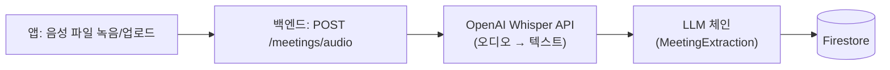

# PRD (Main/확장) — 회의록 STT 요약 서비스 풀 버전

> 상태: **미니 프로젝트 마감 이후(또는 시간 여유 시)를 위한 확장 계획.** MVP가 먼저 끝까지 동작해야 여기로 넘어옴 — MVP는 [PRD-MVP.md](PRD-MVP.md) 참고. 데이터 모델은 [ERD.md](ERD.md)의 "Main 확장 스키마" 섹션 참고.

## 1. MVP 대비 무엇이 늘어나는가

| 영역 | MVP | Main |
|---|---|---|
| STT 입력 | 텍스트 붙여넣기만 | **음성 파일 업로드 → Whisper API로 실제 변환** |
| 사용자 | 단일 사용자, 인증 없음 | **Firebase Auth 도입, 사용자별 회의록 분리** |
| 저장소 | Firestore만 | Firestore + **Redis(캐시·카운터)** |
| 보안 | 최소 조치(6절) | **PII 마스킹, Rate Limiting, 접근 제어 확대** |
| 검색 | 목록 조회만 | 제목/날짜/담당자 검색·필터 |
| 비용 관리 | 입력 길이 제한만 | 토큰 사용량 모니터링·알림 |

## 2. STT 엔진 실연동 — OpenAI Whisper API



- 기존에 이미 쓰고 있는 OpenAI API 키를 그대로 재사용(새 계정·인증 불필요)
- 오디오 파일 크기·길이 제한 필요(Whisper API 자체 제한: 파일당 25MB)
- 변환 실패(잡음·다국어 등) 시 사용자에게 재시도 안내

## 3. 인증 — Firebase Auth

Firestore·Firebase 생태계를 이미 쓰고 있으므로 자연스럽게 확장 가능.

- 사용자별로 `meetings` 문서에 `owner_uid` 필드 추가 → 본인 회의록만 조회 가능
- **이 시점부터 Firestore Security Rules가 실제로 의미를 가짐** — 만약 앱이 Firestore에 직접 붙는 구조로 바뀐다면(예: 실시간 동기화가 필요해지는 경우) `request.auth.uid == resource.data.owner_uid`같은 규칙 필수
- MVP처럼 계속 백엔드 경유 구조를 유지한다면, 인증은 "백엔드가 Firebase Auth 토큰을 검증"하는 방식으로 충분(Firestore 규칙 불필요)

## 4. 보안 강화

이전 보안 조사(2026-08-21)에서 나온 항목들을 Main 단계에서 정식 반영:

| 항목 | Main에서의 조치 |
|---|---|
| PII/민감정보 | 저장 전 LLM 또는 정규식 기반으로 이름·연락처 등 마스킹하는 전처리 단계 추가, 원문(`raw_text`)은 마스킹본만 저장하거나 TTL 짧게 부여 |
| 프롬프트 인젝션 | MVP 조치(구분자 분리)에 더해, 추출 결과에 "지시 수행" 흔적이 있는지 후처리 검증(예: action_items에 시스템 관련 문구가 섞였는지 체크) |
| Rate Limiting | 사용자/앱 단위로 시간당 요청 수 제한(예: Redis를 카운터로 활용 — TTL 기반 요청 수 추적) |
| 비용 모니터링 | 일별 토큰 사용량을 Firestore 또는 별도 로그에 집계, 임계치 초과 시 알림 |
| 감사 로그 | 누가 언제 어떤 회의록을 조회/삭제했는지 최소 로그 남기기 |

## 5. Redis 확장 활용

```
key: session:{uid}:recent        (List)   — 최근 조회한 회의 documentId, LPUSH+LTRIM
key: ratelimit:{uid}:extract     (String) — 시간당 요청 카운터, INCR+EXPIRE
key: stats:meetings:pending      (String) — 전체 미완료 액션아이템 수 캐시(Cache-Aside)
```

## 6. 검색/필터

- Firestore `where` 쿼리로 날짜 범위·담당자별 필터
- 필요 시 제목 키워드 검색은 Firestore 기본 기능만으론 부족 — Algolia 연동 등은 범위 밖으로 유지(과잉설계 방지, 실제 필요해지면 별도 검토)

## 7. 열린 질문

- Main 단계까지 갈 시간이 실제로 있는지 — 미니 프로젝트 마감 안에서는 MVP 완성이 최우선, Main은 "여유 있으면" 순위
- Firebase Auth 도입 시 앱 로그인 UX를 어떻게 가져갈지(이메일/구글 로그인 등)
