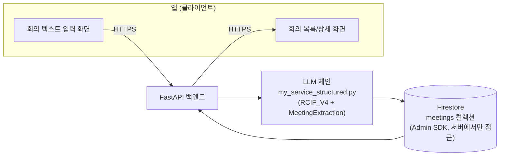

# PRD (MVP) — 회의록 STT 요약 서비스

> 상태: ✅ **채택됨(2026-08-24)** — 옆사람과 진행하는 미니 프로젝트 최종 주제. 후보 비교 이력은 study 저장소의 `notes/mini-project-db-pair-plan.md` 참고(이 레포 밖, 개인 학습 기록), 확장 버전은 [PRD-MAIN.md](PRD-MAIN.md), 데이터 모델은 [ERD.md](ERD.md) 참고.

## 1. 배경

MCP 과정 3주차 "DB 파트"(RDBMS·PostgreSQL·NoSQL/Firestore·Redis)를 마치고, 옆사람과 2인으로 진행하는 미니 프로젝트. 주제는 자유이되 "이번 주 교육 내용에 맞출 것"이 조건.

1주차에 이미 만들어둔 "마이 서비스 조각"(`practice/my-llm-service/my_service_structured.py` — 회의록 텍스트를 구조화된 액션아이템으로 추출하는 LangChain 체인)을 이번 주 배운 **Firestore(NoSQL 문서형 DB)** 와 연결한다.

**구조는 웹이 아니라 앱**이다 — 아래 아키텍처는 이를 반영.

## 2. 목표 (MVP)

- 지난주(LLM 구조화 출력) + 이번 주(DB) 학습 내용을 하나의 동작하는 앱으로 통합
- **왜 관계형 DB 대신 NoSQL(Firestore)을 선택했는지**를 실제 데이터 구조 근거로 설명할 수 있는 발표 소재 확보
- 2인이 짧은 기간 안에 끝까지 완성할 수 있는 범위로 한정(MVP는 기능보다 "끝까지 돌아가는 것"이 우선)

## 3. 사용자 / 사용 시나리오

- 사용자: 회의 참석자(또는 이 과정 수강생이 자기 수업 녹취를 정리하는 상황을 시나리오로 삼아도 됨)
- 시나리오: 앱에서 STT로 변환된 회의 텍스트를 붙여넣음 → 자동으로 결정사항·액션아이템(담당자·기한)이 추출됨 → 앱에서 저장된 회의 목록을 조회

## 4. 아키텍처 — 앱↔백엔드↔Firestore (보안 결정 반영)

**앱은 Firestore에 직접 붙지 않고, 반드시 백엔드(FastAPI)를 거친다.** 이유: 앱(클라이언트)에 Firestore 서비스 계정 키를 심으면 리버스 엔지니어링으로 유출되고, 클라이언트 SDK 직접 연결 시엔 Firestore Security Rules를 별도로 정교하게 설계해야 하는 부담이 생김 — MVP 단계에서는 백엔드 경유로 이 리스크 자체를 없앤다(이전 보안 조사 1번 항목 결론 반영).



앱은 Firestore 주소도, 서비스 계정 키도 알지 못한다 — 오직 백엔드 API 엔드포인트 하나만 안다.

## 5. 핵심 기능 (MVP 범위)

| # | 기능 | 설명 | 재사용 코드 |
|---|---|---|---|
| 1 | 회의록 추출 | STT 텍스트 → `status`·`decisions`·`action_items` 구조화 출력 | `my_service_structured.py`의 `MeetingExtraction` 스키마·체인 그대로 |
| 2 | 회의 저장 | 추출 결과를 Firestore `meetings` 컬렉션에 문서 1건으로 저장 | 신규 — [ERD.md](ERD.md) |
| 3 | 회의 목록 조회 | 저장된 회의 목록을 날짜순으로 조회 | 신규 |
| 4 | 회의 상세 조회 | 특정 회의의 결정사항·액션아이템 상세 조회 | 신규 |

## 6. MVP에 포함하는 최소 보안 조치

과잉설계는 아니지만, 아래 4가지는 MVP에서도 빼지 않는다 — 전부 "안 하면 바로 사고로 이어지는" 최소선이라 나중에 추가하기보다 처음부터 넣는 게 비용이 더 낮음.

| 항목 | 조치 | 이유 |
|---|---|---|
| 서비스 계정 키 | `serviceAccountKey.json`은 백엔드 서버에만 존재, `.gitignore` 유지 | 앱에 심으면 유출됨(보안 조사 5번) |
| 프롬프트 인젝션 완화 | 시스템 프롬프트에서 사용자 입력을 "지시가 아니라 데이터"로 명확히 구분(구분자/역할 분리), 회의록 텍스트에 지시문이 섞여도 무시하도록 프롬프트에 명시 | 사용자가 입력하는 STT 텍스트가 곧 프롬프트 일부가 됨(보안 조사 3번) |
| 입력 길이 제한 | STT 텍스트 입력에 최대 길이 제한(예: 2만자) | 토큰 비용 폭탄·Firestore 문서 크기(1MB) 제한 대비(보안 조사 4번) |
| Firestore 접근 경로 단일화 | 모든 Firestore 접근은 백엔드 Admin SDK 경유만 허용, 앱은 절대 직접 접근 안 함 | 4번 아키텍처 결정과 동일 이유 |

## 7. MVP 범위 밖 (Main으로 이월 — [PRD-MAIN.md](PRD-MAIN.md) 참고)

<!-- 1주차 팀 프로젝트 때 썼던 스코프 가드레일과 같은 원칙 재사용 -->

- ❌ 실제 음성 파일 → 텍스트 변환(Whisper API 연동) → ✅ MVP는 이미 텍스트로 변환된 STT 결과물을 붙여넣기로 입력
- ❌ 사용자 인증·다중 사용자 권한 분리 → ✅ 단순 API, 인증 없음(데모용 단일 사용자 가정)
- ❌ Redis(캐시·카운터) → ✅ MVP는 Firestore만으로 완성, Redis는 여유 있을 때 확장
- ❌ PII 마스킹·민감정보 자동 필터링 → ✅ MVP는 데모 데이터를 사람이 직접 선별(개인정보 없는 것만)
- ❌ 실시간 스트리밍 처리 → ✅ 텍스트 전체를 한 번에 받아 처리(배치)
- ❌ Rate limiting·비용 모니터링 → ✅ 데모 규모(2인, 짧은 시연)라 우선순위 낮음, 입력 길이 제한으로만 최소 방어

## 8. API 개요 (백엔드, 초안)

```
POST /meetings/extract   — STT 텍스트 입력 → 구조화 추출 + Firestore 저장, 결과 반환
GET  /meetings           — 저장된 회의 목록(날짜순)
GET  /meetings/{id}      — 특정 회의 상세(결정사항·액션아이템)
```

## 9. 비기능 요구사항

- API 키·서비스 계정 키는 `.env`/`.gitignore` 관리 원칙 유지
- 데모용 회의 데이터는 `notes/transcripts/`의 실제 수업 녹취 중 **개인정보·민감내용 없는 것만** 선별해서 사용

## 10. 열린 질문 (Open Questions)

- 마감일·평가 기준 — 강사 확인 필요
- 역할 분담 — 옆사람과 논의 필요(현재 안: 한 명 LLM 체인+백엔드 API, 한 명 앱 UI+Firestore 스키마)
- 앱 플랫폼(모바일 네이티브 vs 크로스플랫폼 vs 데스크톱) — 미확정, 정해지면 반영

## 11. 일정 (미확정 — 마감일 확인 후 채울 것)

- [ ] 주제·앱 플랫폼 확정(옆사람과)
- [ ] Firestore 스키마 확정 → [ERD.md](ERD.md)
- [ ] 추출 체인 연결 + 프롬프트 인젝션 방어 문구 추가
- [ ] 백엔드 API 구현
- [ ] 앱 UI(최소) 구현
- [ ] 발표 준비(왜 Firestore인지 + 보안 결정 근거 포함)
